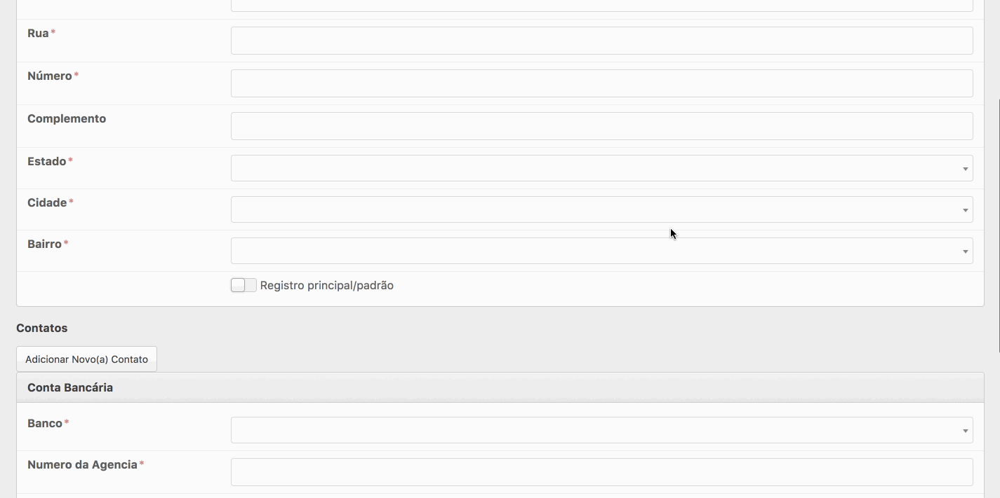

# ActiveAdmin Form Errors
Pretty form errors by default in your ActiveAdmin.



## Installation
**1. Import gem**
```ruby
gem 'active_admin-form_errors'
```

**2. Import stylesheets (change `app/assets/stylesheets/active_admin.scss`)**
```scss
@import 'active_admin/form_errors';
```

## Options
**Disable it in a specific resource**
```ruby
ActiveAdmin.register User do
  config.form_errors = false
end
```

**Disable by default at all resources (change `config/initializers/active_admin.rb`)**
```ruby
ActiveAdmin.setup do
  config.form_errors = false
end
```

**Show only specific errors**
```ruby
ActiveAdmin.register User do
  config.form_errors = lambda do
    if current_user.admin?
      resource.errors.keys
    else
      [:name, :email]
    end
  end
end
```

**Change the color base**
```scss
$form-errors-color: red; // must be before the import

@import 'active_admin/form_errors';
```

## Maintainer
[Dhyego Fernando](https://github.com/dhyegofernando)
